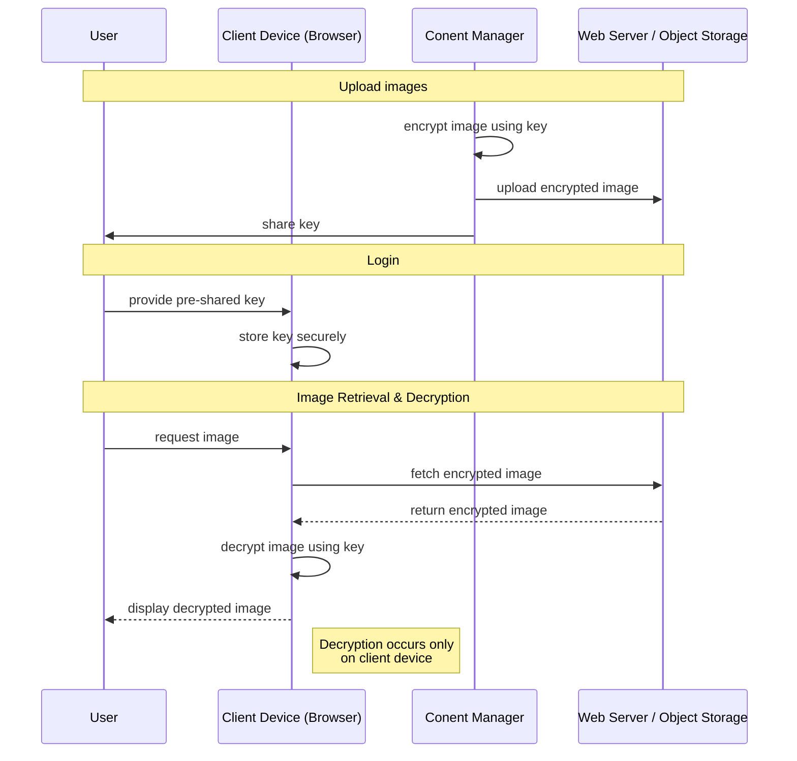
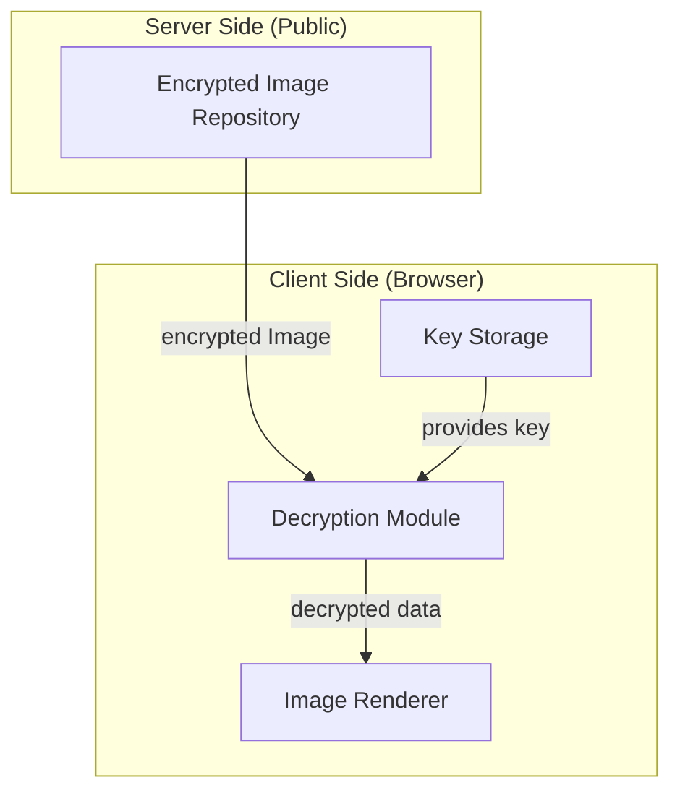

# Static web application to display encrypted images

This application is a proof of concept for client-side, on-the-fly decryption of encrypted images,
retrieved from a web server or from an object storage.
It leverages the AES-256 encryption algorithm to ensure that images are stored and transmitted in an encrypted state,
with decryption occurring only on the client device using a pre-shared key.
This approach prioritizes data privacy and security.

One of the motivations for creating that app was the major strategic shift by
a leading technology conglomerate to integrate artificial intelligence across all its widely-used
social media platforms, as shown by numerous AI-related announcements.
They train their AI using vast amounts of public data, including photos, from users since 2007,
to power various features, like image generators.
While users in regions like the EU can formally object (opt-out) due to data protection laws like GDPR,
data collection of the company is extensive, impacting global user privacy and sparking significant debate
and legal challenges over consent and data use.

## Benefits of client-side decryption for data privacy

The core benefit lies in moving the security boundary from the server/storage layer to the individual client device,
creating a powerful mechanism for zero-trust data handling.

* Enhanced Privacy Against Internal Threats (Zero-Trust)

  The data (images) remains perpetually encrypted on the server, in the database, and in the object storage
  (like S3 or Azure Blob Storage).

  This protects the data from insider threats. Even a database administrator, a storage engineer,
  or a compromised server component cannot view the original images, as they only have access to the ciphertext.
  The decryption key is never stored alongside the data, and crucially, is never exposed on the server side.

* Mitigating Unintended AI Training Data Exposure

  Giant social media sites often scrape user images and use them en masse for training large-scale AI models
  (e.g., facial recognition, object detection) without explicit, granular user consent.
  If the images are delivered to the server in an encrypted state and are only decrypted locally for viewing,
  the server-side image repository only contains the ciphertext.

  For the AI model to train on the images, it would first need to be given the key and the decryption logic,
  which an organization could choose to withhold based on user preference settings ("Do not use my images for AI training").
  This forces the organization to explicitly process the data for training,
  instead of passively ingesting it from an unencrypted pool. It provides a technical barrier and
  accountability layer for responsible data usage.

* Compliance with Regulations

  This approach aligns perfectly with data protection principles like GDPR (Europe) and CCPA (California),
  particularly concerning pseudonymization and encryption in transit and at rest.

  Demonstrating that data is stored in a practically inaccessible, encrypted state can
  significantly ease regulatory compliance burdens and reduce fines in the event of a breach.

In short, client-side decryption provides true end-to-end security for the image content,
transforming the stored data from an image into an opaque, useless blob until it reaches the intended,
authorized viewer's device.

## Client-side decryption workflow



### Components



## Encryption process for content manager

* Put unencrypted files into `source` folder.

  Source files are required to adhere to a specific naming convention: `YYYYMMDD_XX_T.ext`,
  where `YYYYMMDD` represents the date, `XX` is an index, and `T` denotes the file type
  (`p` for WebP images, `x` for JPEG-XL images, or `m` for WebM videos).
  The file extension must also correspond to the specified type, e.g. `20250130_01_p.webp`.

  Currently, only `webp`, `jxl` and `webm` file formats are supported.

  Make sure to exclude this folder from public access.

* Update `source/images.json` with the newly added image content e.g.:

  ```js
  [
    {
      "id": "20250101_01_p.webp",
      "title": "Another Sample Title",
      "description": "Another Sample Description",
      "date": "2025-01-01"
    },
    {
      "id": "20250102_01_p.webp",
      "title": "Sample Title",
      "description": "Sample Description",
      "date": "2025-01-02"
    }
  ]
  ```

  Images will be ordered by date, type (i.e. webp or webm) and id, ascending.

* Execute `crypt.js` with Node.js using the following parameters:

  ```bash
  node crypt.js enc password
  ```

  where `password` is the mutually agreed password.

  Enrypted content will go into the `asset/content` folder with the `.arc` extension,
  e.g. `asset/content/2025/20250130_01_p.arc`, `asset/content/images.arc` etc.

  `asset` folder must be public.

* Upload encrypted files to web server or object storage.

## Storage configuration

Image files can be served from different sources,
which is driven by the application configuration stored in the `app.json` file.
The encryted `app.arc` file must be served from the same server as the web application.

Examples:

* Serve files from the same server as the web application, from `assets/content` folder:

  ```js
  {
    "storage": "asset/content"
  }
  ```

* Serve files from an object storage service (e.g. S3, Cloudflare R2):

  ```js
  {
    "storage": "https://assets.service.com"
  }
  ```

## Example folder structure

```
 |-- asset                          # publicly accessible assets
 |   |-- css                        # CSS files required by the web app
 |   |-- font                       # font files required by the web app
 |   |-- content
 |   |   |-- app.arc                # enrypted app configuration
 |   |   |-- images.arc             # encrypted images index (if files shared from the same web server)
 |   |   `-- 2025
 |   |       |-- 20250101_01_p.arc  # encrypted image (if files shared from the same web server)
 |   |       `-- 20250102_01_p.arc  # encrypted image (if files shared from the same web server)
 |   |-- image                      # images required by the web app (e.g. logos, icons), not encrypted
 |   `-- js                         # JS files required by the web app
 |-- source                         # source files for the content manager (must be non-public)
 |   |-- app.json                   # app configuration
 |   |-- images.json                # images index
 |   |-- 20250101_01_p.jxl          # image
 |   `-- 20250102_01_p.jxl          # image
 |-- index.html                     # entry point of the web application
 `-- crypt.js                       # encryption utility for the content manager
```

## Encrypted file format summary

The file uses the ARC file archive structure as a data container
and employs the robust AES-256-CBC encryption standard for the wrapped data part.

The file uses the `.arc` file extension, and it is compatible with the legacy ARC 5.21 file archive utility.
It has been chosen due to its compact header size, including basic file integrity information,
and also as a tribute to old archive formats.
File integrity checks can be performed with external utilities like: `arc`, `lsar`, `nomarch` etc.

In case of json files, additional zlib compression is applied before the encryption.
This is important as json files are cached in local storage.

### Encryption configuration

Feature	          | Details
----------------- | -------
Cipher Algorithm  | AES (Advanced Encryption Standard) with a 256-bit key size.
Mode of Operation | CBC (Cipher Block Chaining).
Padding Scheme    | PKCS#7.
Key Derivation    | PBKDF2 (Password-Based Key Derivation Function 2) using the SHA-256 hash function.

### File header structure

The file header is a fixed structure followed by the variable-length encrypted data:

Section                    | Length (Bytes) | Purpose
-------------------------- | -------------- | -------
ARC Header                 | 29             | Standard ARC archive metadata. (detailed in [ARC File Format](https://en.wikipedia.org/wiki/ARC_(file_format)))
Salt                       | 16             | Used by the PBKDF2 function for key derivation.
Initialization Vector (IV) | 16             | Used by the AES-256 CBC mode to ensure uniqueness for each encryption.
Encrypted Data             | Variable       | The actual ciphertext.
ARC EOF Marker             | 2              | End-of-file marker for the ARC format.

## Used JavaScript libraries

* encryption/decryption is done via the [crypto-js](https://github.com/brix/crypto-js)
* JPEG-XL decoding support is implemented via a modified version of [jxl.js](https://github.com/niutech/jxl.js) for browsers that do not support JPEG-XL natively
* zlib compression/decompression is performed via [pako](https://github.com/nodeca/pako)
* local storage based caching is implemented via a modified version of [lscache](https://github.com/pamelafox/lscache)
* JavaScript source code is minified via [UglifyJS 3](https://github.com/mishoo/UglifyJS)

## Other optional tools

* [Graphics Magick](http://www.graphicsmagick.org/) to convert/edit from/to supported image formats
* [ffmpeg](https://www.ffmpeg.org/) to covert videos from/to supported video formats
* [rclone](https://github.com/rclone/rclone) to sync files to various object storage solutions
* [Ruby](https://www.ruby-lang.org/en/) to execute convenience scripts for the content manager
